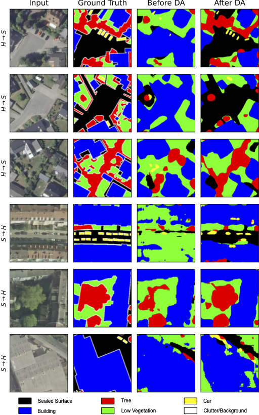

# Binary-space-partitioning-based Semantic Segmentation and Domain Adaptation for Aerial Images
Reference implementation for the method described in my PhD thesis "Semantic Segmentation and Domain Adaptation of
Aerial Images Using Binary Space Partitioning" (will be published soon). It builds on previous works I worked contributed to, [SegForestNet](https://github.com/gritzner/SegForestNet) and [FFT-based appearance adaptation](https://github.com/gritzner/FFTAA). Please cite my PhD thesis if you use anything from this repository, even if you only use undocumented features, e.g., vector quantization, a DCT side-channel, skip connections that jump over my model's decoders, etc. I will update this citation once the thesis is actually available.

```bibtex
@phdthesis{gritzner2026bspda,
  title={Semantic Segmentation and Domain Adaptation of Aerial Images Using Binary Space Partitioning},
  author={Gritzner, Daniel},
  school={Gottfried Wilhelm Leibniz Universität Hannover, Fakultät für Elektrotechnik und Informatik},
  year={2026}
}
```

# Results
My approach delivers state-of-the-art performance in domain adaptation for small-scale aerial image datasets (see thesis for details). Mean improvements over the baseline (no domain adaptation) in $F_1$ scores ($\Delta mF_1$) across 42 domain pairs and different configurations are shown below:

| appearance adaptation | feature adaptation | self-training | mean improvement [$\Delta mF_1$] |
| :----: | :----: | :----: | :----: |
| ✅ | ❌ | ❌ | 3.8% |
| ✅ | ✅ | ❌ | **4.3%** |
| ✅ | ✅ | ✅ | 2.0% |
| ✅ | ❌ | ✅ | 3.2% |
| ❌ | ✅ | ❌ | -2.8% |
| ❌ | ✅ | ✅ | -2.2% |
| ❌ | ❌ | ✅ | -8.1% |

The [previous state of the art](https://github.com/gritzner/FFTAA) achieved a mean improvement of 2.5% $\Delta mF_1$. Samples of using the top configuration (domains: H = Hannover, S = Schleswig; source -> target):



# How to run
### Dependencies
The code has been tested on openSUSE Leap 15.6 running the following software:
* cargo 1.79.0
* cuda 11.6.1
* libtiff 4.5.0
* matplotlib 3.7.0
* numpy 1.23.5
* opencv 4.6.0 
* python 3.10.10
* pytorch 1.13.1
* pyyaml 6.0
* rustc 1.79.0
* scikit-learn 1.2.1
* scipy 1.10.0
* timm 0.9.2
* torchvision 0.14.1

Optional dependencies:
* geotiff 1.7.0
* tifffile 2021.7.2

### Preparation
Create a file called ```~/.aethon/user.yaml``` based on this example:

```yaml
git_log_num_lines: 12
dataset_paths:map:
    - [hannover, /path/to/Hannover]
    - [buxtehude, /path/to/Buxtehude]
    - [nienburg, /path/to/Nienburg]
    - [vaihingen, /path/to/Vaihingen]
    - [potsdam, /path/to/Potsdam]
    - [hameln_DA, /path/to/Hameln]
    - [schleswig_DA, /path/to/Schleswig]
    - [adapted_root, /path/of/your/choice/for/storing/adapted/datasets]
model_weights_paths:map:
    - [SegNeXt_tiny, /path/to/the/adapted/mscan_t.pt.xz]
    - [SegNeXt_small, /path/to/the/adapted/mscan_s.pt.xz]
    - [SegNeXt_base, /path/to/the/adapted/mscan_b.pt.xz]
    - [SegNeXt_large, /path/to/the/adapted/mscan_l.pt.xz]
```

Run my framework once like this in a terminal in the directory you cloned this repository into to compile the Rust code:

```shell
python aethon.py --compile
```

### Running the code
Open a terminal in the directory you cloned this repository into. First, you should start to prepare the datasets for faster loading and execute the following command for each dataset:

```shell
python aethon.py styletransfer_init <dataset>
```

The prepared dataset can then be found in ```tmp/datasets/dataset.npz``` and should be copied to ```$ADAPTED_ROOT/<subset>/<dataset_name>.npz```, e.g., ```$ADAPTED_ROOT/full/potsdam.npz``` or ```$ADAPTED_ROOT/no_blue/vaihingen.npz```. ```$ADAPTED_ROOT``` is the same as the path set in your ```user.yaml```. The dataset names are the same as in your ```user.yaml```, too. If you want to create ```no_blue``` versions of the datasets other than ```vaihingen```, remove the ```#``` in lines 10 and 11 of ```cfgs/styletransfer_init.yaml```.

In case you are wondering why ```cfgs/styletransfer_init.yaml``` appears to be incomplete: the actual configuration file parsed by our framework is the concatenation of ```core/defaults.yaml``` and ```cfgs/styletransfer_init.yaml```. Therefore, to be able to follow all references and see all the hyperparameters used, you need to refer to both files. After executing my framework you will find a complete version of the configuration in the ```output_path``` set near the top of the configuration file.

Next, after preparing the datasets, use this to perform the actual appearance adaptation:

```shell
python aethon.py styletransfer <subset> <source> <target> <method>
```

Here, subset should be ```no_blue``` or ```full```. ```source``` and ```target``` are the datasets you want to use. ```target``` will take on the appearance of ```source```. As ```method```, I recommend creating adaptations using both, ```zca``` and ```zcacorr```. In fact, the subsequent examples assume you created these two adapted variants (```zca``` and ```zcacorr```) for all domain pairs in both directions. If you want to adapt a domain A (source) to a domain B (target), you need to run appearance adaptation for both methods in the A->B (source->target) and the B->A direction. Other options for the adaptation ```method``` can be found in ```compute_whitening_matrix``` in ```utils/__init__.py```. The result can be found in the appropriate subfolder of ```tmp/styletransfer``` and will be called ```dataset.npz``` again. Copy this file to ```$ADAPTED_ROOT/<subset>/<method>/<source>/<target>.npz```.

Then, to train a segmentation model:

```shell
python aethon.py semseg <subset> <source> <target> <learning_rate>
```

As learning rates I recommend:
| Dataset | Learning Rate |
| :----: | :----: |
| __Buxtehude__ | 0.007 |
| __Hannover__ | 0.00565 |
| __Hameln__ | 0.015 |
| __Nienburg__ | 0.0041 |
| __Potsdam__ | 0.00365 |
| __Schleswig__ | 0.0039 |
| __Vaihingen__ | 0.0095 |

The resulting model weights can be found in the appropriate subfolder of ```tmp/semseg``` and will be called ```<epoch>_*.pt.xz```. The file ```history.json.xz``` in the ```output_path``` will contain details of the training process, including the mean $F_1$ score on the validation set. You can use this information to find out which model weights are the best ones (highest validation score).

For feature adaptation, copy the model weights you want to use to ```tmp/model.pt.xz``` and run 

```shell
python aethon.py feature_adaptation <subset> <source> <target>
```

or 

```shell
python aethon.py feature_adaptation2 <subset> <source> <target> <method>
```

depending on whether you want to adapt the features to a target dataset which has not been appearanced adapted (first variant) or to an appearanced adapted target dataset (second variant; ```method``` specifies the method used for the appearance adaptation of the target dataset).

After feature adaptation there will be a file called ```logits.npz``` in the ```output_path```. Copy this file to ```tmp/logits.npz```. You will also need the same model weights ```tmp/model.pt.xz``` as before. Then run

```shell
python aethon.py selftraining <subset> <dataset> <threshold> <learning_rate>
```

for self-training. Here, ```dataset``` is your target domain. As ```threshold``` I recommend trying 0.02 or 0.3 (these correspond to $t = 0.98$ and $t = 0.7$, respectively, in section 5.3 of my thesis). As ```learning_rate``` I recommend 0.0032, 0.0033, or 0.0037.

To evaluate one or more models on another dataset, copy the weight files ```*.pt.xz``` to ```tmp/models/*.pt.xz``` and then run:

```shell
python aethon.py eval <subset> <dataset>
```

or 

```shell
python aethon.py eval2 <subset> <source> <target> <method>
```

depending on whether you want to evaluate on an unadapted dataset (first variant) or on an adapted variant (second variant). The models will be evaluated on ```target``` in the second variant. Again, evaluation details can be found in ```history.json.xz``` in the ```output_path```.

If you want to skip feature adaptation the evaluation runs can also be used to generate the necessary ```logits.npz``` by setting ```save_logits``` in line 91 of both, ```cfgs/eval.yaml``` and ```cfgs/eval2.yaml```, to ```True```.

Even though I cannot provide some of the datasets used in the paper for legal reasons I still provide their data loaders as a reference. The data loaders can be found in ```datasets/```.

### Backbones
I tested the following models from the ```timm``` library and can confirm that my code works with them:
* CNN:
    * legacy_xception
    * convnextv2_atto.fcmae
    * convnextv2_femto.fcmae
    * convnextv2_pico.fcmae
    * convnextv2_nano.fcmae
    * convnextv2_tiny.fcmae
    * convnextv2_base.fcmae
    * convnextv2_large.fcmae
    * convnextv2_huge.fcmae
* ViT:
    * vit_tiny_patch16_224
    * vit_small_patch16_224
    * vit_base_patch16_224
    * vit_large_patch16_224
    * vit_base_patch16_224.mae
    * vit_large_patch16_224.mae

If you want to use one of the vision transformers (ViT) you have to add ```vit: True``` next to the line ```backbone: ...``` at the same level of indentation as ```backbone: ...``` to the configuration file. You might also have to disable pretrained weights or you have to adjust the input channels (remove NDVI and DSM/depth) if you want to use a ViT-based backbone.

# More information
If you want to use SegNeXt as backbone, you need to download the weights for mscan_\*.pth from the [SegNeXt repository](https://github.com/Visual-Attention-Network/SegNeXt) and adapt the weights for use in my framework by executing ```utils/preprocess/segnext.py``` first. Then, simply removing line ```backbone: legacy_xception``` from the configuration file entirely will cause my framework to switch to SegNeXt.

My framework supports creating a convenient archive file of itself for easy copying to another node in a network, e.g., when running multiple parallel instances via a system like SLURM. Simply execute ```python aethon.py @archive```. Make sure to compile the Rust code before creating an archive!

For historical reasons some files and variables are called ```logits``` despite actually containing probabilities. When you see some code treating something that are supposedly ```logits``` like probabilities, then the variable (or file) will actually contain probabilities. I did not update all names when migrating from using/storing logits to probabilities to avoid unnoticed errors from creeping into the codebase.

The repository for [previous work](https://github.com/gritzner/SegForestNet) contains additional information, e.g., if you want to extract the code for my model, SegForestNet, to run it outside of my own custom-built training environment or if you want to run my environment within a Jupyter notebook.
